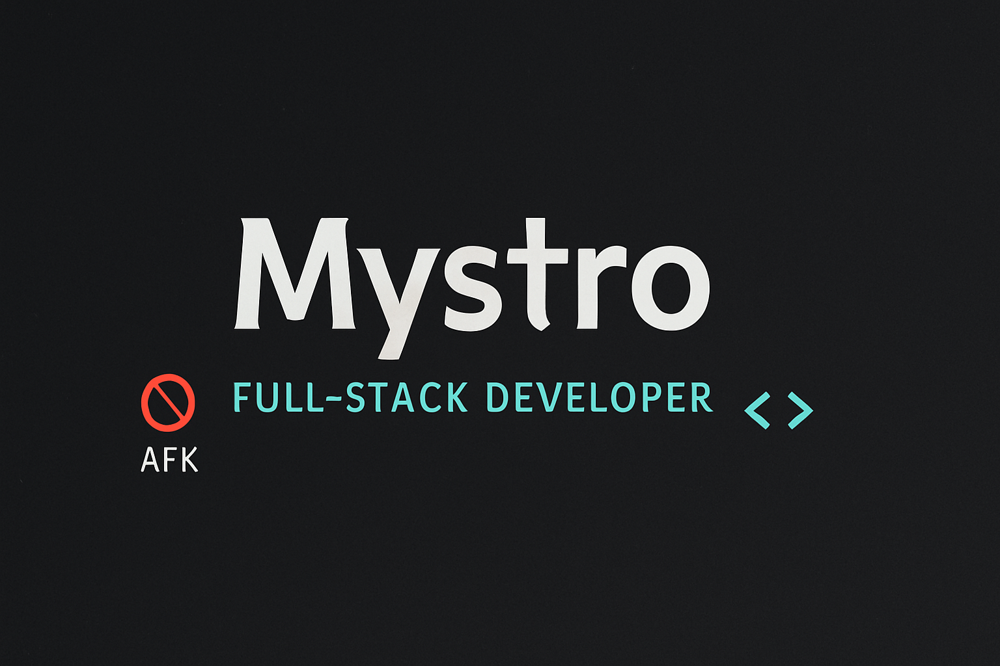

# Hey, I'm Mys†ro 👨‍💻

🚫 AFK but everywhere  
Full-stack developer | Problem solver | Builder in the dark  

---

### 🔧 Tech Stack  

---

### 📈 Currently Working On:
- 🧠 Personal dev tools
- ⚙️ Automation scripts
- 🛠️ Open-source contributions soon...

---

### 📡 Find me elsewhere

